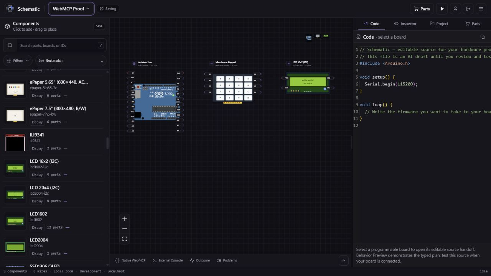
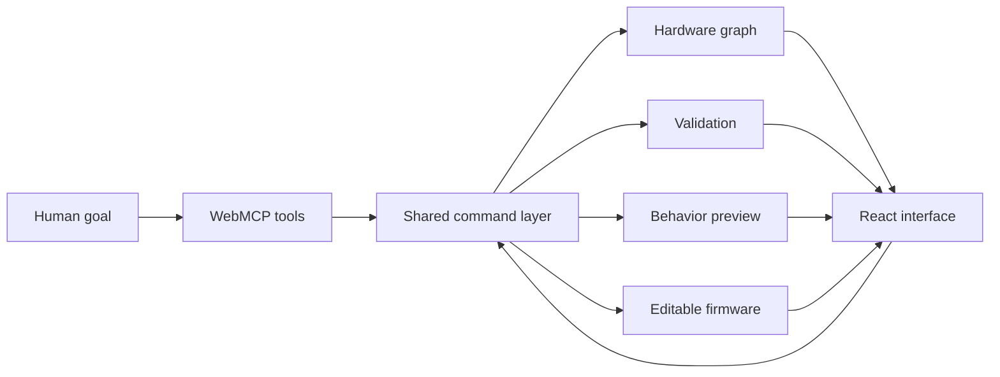

<div align="center">
  

# Schematic

### Design connected hardware with an AI agent, without giving up human control

Schematic is an agent-native hardware workspace for assembling components, wiring circuits, validating designs, previewing behavior, and preparing editable firmware.

[](https://schematic-hardware-workspace.decipherer71.chatgpt.site/studio)
[](frontend/src/webmcp/tools.ts)
[](LICENSE)

</div>

<p align="center">
  
</p>

<p align="center"><sub>Real application capture: Arduino Uno, membrane keypad, I2C LCD, component catalog, hardware canvas, and editable firmware.</sub></p>

## What Schematic does

Schematic turns a hardware goal into an inspectable project that a person and an agent can edit together. Both use the same project state, validation rules, behavior engine, and undo history.

- Search a typed catalog of boards, sensors, displays, controls, and actuators
- Place components and create pin-aware connections
- Validate wiring and surface actionable issues
- Propose, preview, approve, undo, and verify design changes
- Create deterministic behavior plans and interact with their visual output
- Write, edit, check, download, and export ordinary firmware source files
- Save projects locally and exchange them through `.vlx` files

## Why WebMCP fits hardware design

Hardware design spans many precise actions. A visual-only agent must guess which controls to click, how components are represented, and whether a wire is valid. Web Model Context Protocol (WebMCP) gives the agent typed operations and structured results instead.

With Schematic, a person states the goal and reviews consequential changes. The agent can inspect the current graph, find compatible parts, propose a design, show the pending diff, apply it after approval, validate the result, preview behavior, and prepare firmware. This collaboration was difficult to make reliable through coordinate-based browser automation alone.

| Person | Agent | Shared result |
| --- | --- | --- |
| Describes the device and constraints | Searches compatible components | A concrete bill of materials |
| Reviews a proposed design | Places parts and plans connections | An inspectable hardware graph |
| Approves or rejects changes | Applies, validates, and explains issues | Controlled, reversible edits |
| Tests the intended interaction | Drives typed behavior events | Deterministic preview evidence |
| Edits and owns the source | Creates firmware documents | Exportable code for a real toolchain |

## Try the complete calculator workflow

Open the [live Schematic studio](https://schematic-hardware-workspace.decipherer71.chatgpt.site/studio) in ChatGPT's in-app browser. In Google Chrome, enable `chrome://flags/#enable-webmcp-testing` first.

Ask your agent:

> Create a calculator with an Arduino Uno, a 4×4 membrane keypad, and an I2C LCD. Wire it, validate it, add calculator behavior, preview 7 + 5, write the firmware, and verify the project. Show me the proposal before applying it.

The agent can complete the workflow through WebMCP while every component, wire, validation result, preview state, and source file remains visible in the workspace.

## Native WebMCP implementation

Schematic registers 56 tools through the browser-native imperative API. The production registration is in [`frontend/src/webmcp/tools.ts`](frontend/src/webmcp/tools.ts):

```typescript
document.modelContext.registerTool({
  name: definition.name,
  title: definition.title,
  description: definition.description,
  inputSchema: definition.inputSchema,
  annotations: definition.annotations,
  execute: async (input, options) =>
    definition.execute(input, options),
}, { signal: controller.signal });
```

Each tool definition includes a stable name, concise description, JSON Schema input, security annotations, and an executable handler. Tool calls enter the same command layer used by the visible interface, so agent actions immediately appear on the canvas.

Schematic does not create a fake `document.modelContext`. When the browser does not provide native WebMCP, the app reports the missing capability. A separate `window.schematicWebMCP` bridge supports local development and deterministic tests without claiming native discovery.

### Tool surface

The registry groups 56 tools around complete tasks instead of exposing UI clicks:

| Area | Examples | Purpose |
| --- | --- | --- |
| Projects | `project.create`, `project.get_graph`, `project.verify` | Manage and inspect hardware projects |
| Components | `component.search`, `component.add`, `component.remove` | Find and place compatible parts |
| Connections | `connection.connect`, `connection.remove` | Create and edit pin-aware wiring |
| Design | `design.propose`, `design.preview`, `design.apply`, `design.undo` | Review and control multi-step changes |
| Behavior | `behavior.plan.write`, `behavior.preview`, `behavior.invoke` | Define and inspect deterministic interactions |
| Code | `code.write`, `code.read`, `code.export` | Manage editable firmware documents |
| Validation | `validation.check` | Return structured graph diagnostics |
| Shopping | `shopping.search`, `shopping.compare`, `shopping.quote` | Research parts with provenance |

See the [complete tool inventory and schemas](docs/webmcp/tools.md).

## How it works



The frontend uses React, TypeScript, React Flow, Zustand, Zod, Monaco Editor, and IndexedDB. The ChatGPT Site wrapper serves the application and same-origin helper routes. WebMCP handlers call the frontend's existing domain operations rather than maintaining a second agent-only state.

## Honest verification boundary

Schematic distinguishes visual evidence from physical verification:

- Behavior Preview runs typed, deterministic plans. It does not execute firmware
- Browser Check supports a bounded Arduino/C++ subset. It is not a compiler or microcontroller emulator
- Graph validation checks the modeled project. It does not verify electrical physics
- Compilation, upload, and physical hardware testing remain external steps
- Projects persist in the current browser profile, not as cross-device cloud storage

These boundaries appear in tool results, exports, and the interface so an agent cannot present a preview as physical proof.

## Run locally

Install Node.js 22.13 or newer and pnpm 9 or newer. Then run:

```bash
pnpm install --frozen-lockfile
npm ci --prefix chatgpt-site
pnpm --filter @schematic/frontend dev
```

Open `http://localhost:3000`. To run the ChatGPT Site wrapper instead:

```bash
pnpm --dir chatgpt-site dev
```

The optional standalone reference API runs with `pnpm dev:backend`. Hosted deployments must use a strong `SCHEMATIC_SESSION_SECRET`.

## Verify the project

Run the complete release gate:

```bash
pnpm verify
```

For a focused WebMCP check:

```bash
pnpm --filter @schematic/frontend test -- src/__tests__/webmcp.test.ts
```

The WebMCP suite verifies all 56 definitions, native registration, complete discovery, duplicate-registration protection, security annotations, and the non-native fallback boundary.

## Repository guide

| Path | Contents |
| --- | --- |
| [`frontend/`](frontend/) | Hardware studio and native WebMCP registry |
| [`packages/behavior/`](packages/behavior/) | Typed plans, profiles, reducers, and preview engine |
| [`chatgpt-site/`](chatgpt-site/) | ChatGPT Site application and same-origin routes |
| [`docs/webmcp/tools.md`](docs/webmcp/tools.md) | Complete WebMCP tool reference |
| [`docs/DEMO_SCRIPT.md`](docs/DEMO_SCRIPT.md) | Judge-focused demonstration flow |
| [`docs/CHATGPT_SITE_RUNBOOK.md`](docs/CHATGPT_SITE_RUNBOOK.md) | Publishing and live verification steps |
| [`ARCHITECTURE.md`](ARCHITECTURE.md) | System architecture and trust boundaries |

## Deployment

The canonical deployment is the [Schematic hardware workspace](https://schematic-hardware-workspace.decipherer71.chatgpt.site/studio). Follow the [ChatGPT Site release runbook](docs/CHATGPT_SITE_RUNBOOK.md) to build, publish, and verify native tool discovery.

## License

Schematic is open source under the [GNU Affero General Public License v3.0](LICENSE). Third-party components retain their original licenses as documented in [NOTICE](NOTICE).
