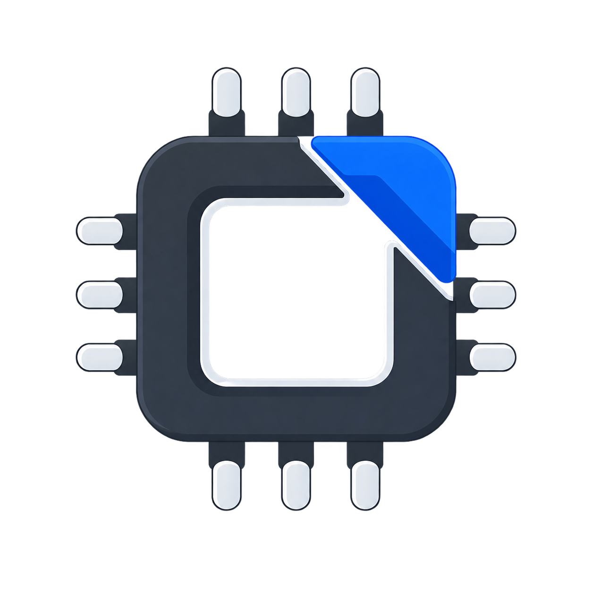

<div align="center">
  

# Schematic

**An agent-native workspace for designing hardware behavior and preparing editable firmware code.**

[](LICENSE)
[](https://react.dev/)
[](frontend/src/webmcp/tools.ts)

</div>

Schematic helps a person or an agent assemble a typed hardware graph, describe
the intended behavior, see that behavior in the canvas, and keep ordinary
Arduino/C/C++/Python source in an editable Code panel. Behavior Preview remains
plan-driven and never executes source. Separately, Browser Check can execute a
bounded documented Arduino/C++ subset for fast feedback before the source is
handed to a real SDK, compiler, uploader, or physical hardware workflow.

## Product boundary

The Behavior Plan is the source of truth for the in-app outcome:

```text
user intent
    ├── graph tools ────────> hardware project
    ├── behavior.plan.write -> validated Behavior Plan
    │                              │
    │                              v
    │                     typed profiles/actions/events
    │                              │
    │                              v
    │                     deterministic visual preview
    │
    └── code.write ----------> editable source files -> bounded Browser Check
                                                   └-> external compiler/hardware handoff
```

Behavior Preview applies checked-in typed component actions to deterministic
reducers. It can show an LED turning on, text appearing on a display, a relay
changing state, a servo moving, a motor changing speed, or a calculator keypad
driving an LCD. Behavior Preview does not parse or execute Code; Browser Check
is a separate bounded source-execution/preflight surface.

Every preview result carries the same honest boundary:

> Behavior Preview is a plan-driven visual outcome. No source code ran in that
> preview, and electrical behavior and physical hardware were not verified.

Browser Check is intentionally narrower: it executes only its documented
Arduino/C++ subset and fails closed on unsupported constructs. It is **not a
compiler, MCU emulator, electrical simulator, uploader, or physical test**.
Real compilation, upload, and hardware bring-up remain external.

## What is implemented

- A React/Zustand hardware graph with catalog search, typed ports, wiring,
  project switching, validation, browser-local persistence, and `.vlx` import/
  export.
- The `@schematic/behavior` package with versioned data-only plans, exact
  catalog profile bindings, bounded payload schemas, deterministic reducers,
  visual projections, logical time, replayable session logs, diagnostics, and
  SHA-256 provenance hashes.
- Profiles for buttons, membrane keypads, deterministic calculator state,
  LEDs/indicators, text displays, buzzers, relays, servos, motors, and numeric
  sensors. A catalog item without an exact profile remains explicitly
  unsupported rather than receiving guessed behavior.
- A Code panel backed by durable multi-file documents. Code can be generated,
  edited, copied, downloaded, and exported without being treated as verified
  firmware.
- Exactly **56 WebMCP tools** across the source registry: 11 project, 5
  workspace, 5 component, 3 connection, 3 firmware, 6 behavior, 3 code, 2
  validation, 10 shopping, and 8 design tools. The high-level design surface
  adds propose → preview → approve/discard, shared undo/redo, goal-level verify,
  and a state-aware shortlist while the primitive tools remain available.
  `firmware.compile` and every `simulation.*` tool remain absent.
- A same-origin Site API limited to health, catalog, import analysis, parts
  discovery, and identity helpers. The retired compile and simulation API paths
  are not canonical ChatGPT Site routes and return 404 there. Repository-root
  compatibility handlers are excluded from the Site package and are not
  product capabilities.

## Behavior and code are intentionally independent

`behavior.plan.write` validates a plan against the active graph and the exact
profile registry. Every write requires `expectedRevision`: `null` is
create-only and the exact current integer revision is required to replace an
existing plan; omission and stale revisions are rejected. `behavior.preview`
prepares a plan and opens an ephemeral
session; `behavior.invoke` dispatches only typed events/actions; and
`behavior.get_state` returns the current snapshot, hashes, diagnostics, and
claims. The session is recreated on reload and invalidated on graph, plan, or
project changes. It is never persisted as executable state.

`code.write`, Monaco edits, and `firmware.write` save source documents with:

- a normalized file list and content SHA-256;
- language, board/FQBN metadata, dependencies, origin, and revision;
- mandatory optimistic exact-hash conflict protection (`expectedContentSha256:
  null` creates source and may replace only Schematic's exact marked generated
  starter scaffold; every real existing document still requires the exact hash
  returned by `code.read`/`firmware.read`; omission is rejected);
- an optional link to a plan/project hash, marked `stale` when either side
  changes; and
- export history plus `inAppVerification: "not-performed"`.

An export from `code.export` includes every file hash, source/project hashes,
target metadata, dependencies, graph diagnostics, preview-link provenance, and
machine-readable false claims for build, execution, upload, and physical test.

## WebMCP surface

The complete inventory and schemas are in
[`docs/webmcp/tools.md`](docs/webmcp/tools.md). The reviewed calculator loop is:

1. `design.propose` → `design.preview` → explicit `design.apply` approval.
2. Schematic places Arduino + membrane keypad + I2C LCD and validates wiring.
3. `behavior.preview` opens the saved calculator plan.
4. `behavior.press_key` drives the real typed keypad reducer; `7`, `+`, `5`, `=`
   makes the LCD projection show `12`, with inputs/results in session evidence.
5. `code.write` replaces only the marked starter with project firmware.
6. `firmware.check` runs bounded Browser Check and `project.verify`/
   `design.verify` report the honest browser-side evidence boundary.
7. Agent graph mutations can be reversed with `design.undo` and replayed with
   `design.redo`; `workspace.get_tool_surface` recommends only stage-relevant
   tools.

Human controls and WebMCP share the same project store, behavior command layer,
validation, reducers, hashes, persistence rules, and structured errors. Models
never receive an arbitrary JavaScript function bridge.

## Local development

Requirements: Node.js 22.13+, pnpm 9+, and a browser for the UI. Python is
needed only for the optional standalone reference API.

```bash
pnpm install --frozen-lockfile
npm ci --prefix chatgpt-site
pnpm --filter @schematic/frontend dev
```

The standalone frontend is normally at `http://localhost:3000`. The hosted
Site wrapper can be run with:

```bash
pnpm --dir chatgpt-site dev
```

The Site's same-origin API does not require a second server. The optional
standalone reference service is:

```bash
pnpm dev:backend
```

Never use development authentication or an empty/weak
`SCHEMATIC_SESSION_SECRET` in a hosted deployment.

## Checks

Focused behavior checks:

```bash
pnpm --filter @schematic/frontend typecheck
pnpm --filter @schematic/frontend test -- --run
pnpm run verify:behavior-preview
```

Site checks:

```bash
npm --prefix chatgpt-site run lint
npm --prefix chatgpt-site run typecheck
npm --prefix chatgpt-site run test
npm --prefix chatgpt-site run build
```

`pnpm run verify` is the repository-wide release gate. It may build or test
dormant/reference workspaces included by the monorepo; that does not make those
packages part of the Site product path. The release gate must additionally
confirm that the initial Site bundle does not import legacy compiler/runtime
modules and that `/api/compile` and `/api/simulation/*` return 404 on the
canonical ChatGPT Site route.

## Persistence, limits, and migration

Projects are stored locally in IndexedDB with localStorage compatibility and
verified-user room keying. This is device-local persistence, not cloud backup or
cross-device synchronization. Preview sessions, timers, reducers, and active
snapshots are ephemeral; plans and code documents are durable JSON data.

Current safety limits include 100 plans/project, 200 rules/plan, 20 actions/rule,
2,000 cues/plan, 100 code documents/project, 128 files/document, 1 MiB/file,
256 dependencies/document, 50 export-history entries, and a 10 MiB `.vlx`
import limit. A local workspace may contain at most 50 projects and its
serialized room snapshot is capped at 8 MiB. If an existing room is over either
workspace limit, hydration enters recovery: the original stored room is left
untouched, every preserved project remains visible and can be selected/exported,
and ordinary edits are blocked. The only recovery mutations are confirmed
project `clear` or `delete` operations that strictly reduce project count or
serialized size; once the room fits, normal authoring resumes. If the room is
beyond the bounded recovery window, make a manual backup before attempting
repair. The behavior runtime also bounds logical preview duration to ten
minutes and validates bounded profile payloads.

Editable source has separate aggregate limits. A single source file is capped
at 1 MiB, but the canonical code documents in one project may contain at most
512 KiB total across all files/documents. The legacy `firmwareTargets` source
mirror is checked with the canonical documents against a 1 MiB serialized
source-container envelope; this is a compatibility/import boundary, not a
compiler or build limit. Source that exceeds a limit is rejected before a
project mutation is persisted.

Destructive model mutations require explicit identity confirmation. Project
delete/clear repeat the exact `projectId`, component removal repeats the exact
`instanceId`, connection removal repeats the exact `connectionId`, and replacing
an active project with a blueprint requires `replace: true` plus the exact
active project id. Blueprint application otherwise creates a new project and
keeps the existing project intact.

The importer accepts legacy firmware source containers and materializes editable
code documents once. Legacy simulation configuration, compiled artifacts,
unknown fields, and unsupported plan versions are retained only under inert
`legacyBehaviorData` quarantine for round-tripping. They are not active preview
inputs, status claims, or executable data. Imported plans and source are
untrusted data: import validates IDs, payloads, paths, sizes, and hashes, and
records `origin: "imported"` plus stale/linked provenance where applicable.
Source code is never loaded as a reducer, callback, or script.

## ChatGPT Site release

- Canonical Site URL:
  [schematic-hardware-workspace.decipherer71.chatgpt.site](https://schematic-hardware-workspace.decipherer71.chatgpt.site)
- Sites project ID: `appgprj_6a913ce4a58881918a47ea49fa0ca505`
- Hosting configuration: [`chatgpt-site/.openai/hosting.json`](chatgpt-site/.openai/hosting.json)
- Release procedure: [`docs/CHATGPT_SITE_RUNBOOK.md`](docs/CHATGPT_SITE_RUNBOOK.md)

The repository records the canonical project binding, but this worktree must be
re-verified before release. Run `pnpm verify`, push only after it is green, then
publish and record the deployed revision. Native WebMCP discovery, the complete
calculator journey, undo/redo, Browser Check, persistence, shopping provenance,
and retired-route 404s remain live acceptance checks. The deployment never
claims that Browser Check is compilation or that physical hardware was tested.

## Further reading

- [Architecture](ARCHITECTURE.md)
- [Behavior Preview and Editable Code Handoff](docs/TYPESCRIPT_WEB_SIMULATION_HANDOFF.md)
- [WebMCP tool schemas](docs/webmcp/tools.md)
- [Demo script](docs/DEMO_SCRIPT.md)
- [ChatGPT Site runbook](docs/CHATGPT_SITE_RUNBOOK.md)
- [Site capability probes](chatgpt-site/SITES_CAPABILITY.md)

## License

Schematic is licensed under [AGPL-3.0](LICENSE). Third-party components retain
their original licenses; see [NOTICE](NOTICE).
